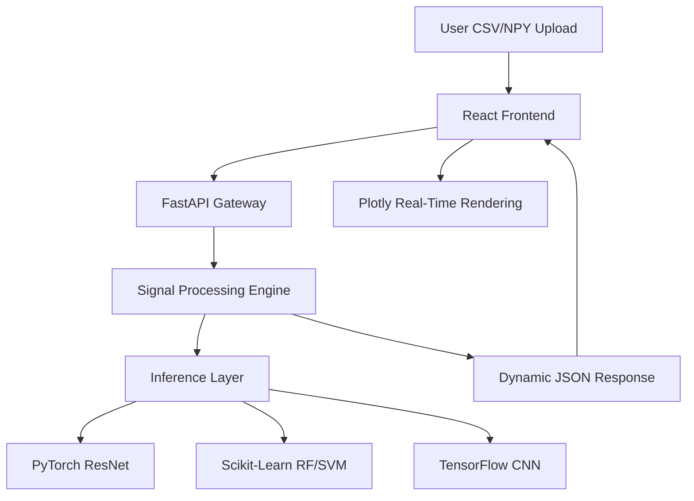

# SignalViewer Pro ⚡
### *The Ultimate Multi-Domain Signal Analysis & AI Orchestration Platform*

[](https://fastapi.tiangolo.com/)
[](https://reactjs.org/)
[](https://pytorch.org/)
[](https://tailwindcss.com/)

**SignalViewer Pro** is a cutting-edge, full-stack analytical platform engineered for the real-time visualization and interpretation of complex time-series data. By merging high-frequency digital signal processing (DSP) with deep learning architectures, it provides a unified interface for Medical, Neuroscience, Acoustic, and Financial analysis.

---

## 🚀 The Core Domains

### 🩺 Medical Analytics (ECG)
*   **Dynamic Lead Discovery:** Automatically detects and renders up to 20 ECG leads (i, ii, iii, aVR, V1-V6, VX, VY, VZ).
*   **Dual-Model Inference:** Concurrent analysis using a **1D-ResNet** for deep feature extraction and a **Random Forest** for classical statistical validation.
*   **Clinical Accuracy:** Real-time signal normalization and statistical feature extraction (Mean, Std, Skew, Kurtosis).

### 🧠 Neuroscience (EEG)
*   **Sliding Window Inference:** Processes high-density EEG data through a synchronized CNN and SVM voting pipeline.
*   **State Classification:** Detects ADFSU, Depression, and PD-REEG states using a consensus-based decision engine.

### 🔊 Acoustic Surveillance
*   **Doppler Physics:** Real-time simulation of frequency shifts and velocity estimation from audio files.
*   **Drone Detection:** MFCC feature extraction coupled with deep classification to identify aerial signatures in acoustic noise.

### 📈 Financial Quant
*   **Market Dynamics:** Candlestick visualization with integrated SMA (Simple Moving Average) overlays.
*   **Forecasting:** Horizon-based price prediction with confidence interval shading.

---

## 🛠 Advanced Signal Transforms
SignalViewer Pro goes beyond simple plotting, offering specialized non-linear analysis modes:
*   **XOR Signal Logic:** Bitwise comparison between primary and secondary signal leads to detect phase synchronization.
*   **Polar Periodicity:** Wraps time-series data around a radial axis to identify harmonic frequencies and rhythmic anomalies.
*   **Recurrence Plots:** Generates distance-matrix heatmaps to visualize the hidden state-space dynamics of a signal.

---

## 🏗 System Architecture



---

## ⚡ Technical Highlights
*   **High-Speed Playback:** Optimized `Plotly.relayout` animation engine for smooth 60FPS scrolling across 15+ simultaneous leads.
*   **Dynamic Ref Handling:** Custom React hook logic to manage an unlimited number of DOM refs for chart containers.
*   **Smart Preprocessing:** Automatic time-column detection, NaN mitigation, and frequency resampling (100Hz/256Hz) performed on-the-fly.

---

## 🔧 Installation & Setup

### Prerequisites
*   Python 3.9+
*   Node.js 18+

### 1. Backend Infrastructure
```bash
cd Backend
pip install -r requirements.txt
python app.py
```

### 2. Frontend Interface
```bash
cd Frontend
npm install
npm run dev
```

---

## 📊 Future Roadmap
- [ ] **Wavelet Transform (CWT):** Adding time-frequency scalograms for medical leads.
- [ ] **Live Streaming:** WebSocket integration for real-time sensor data.
- [ ] **Export Engine:** Generate clinical PDF reports directly from the browser.

## 📄 License
Distributed under the MIT License. See `LICENSE` for more information.
